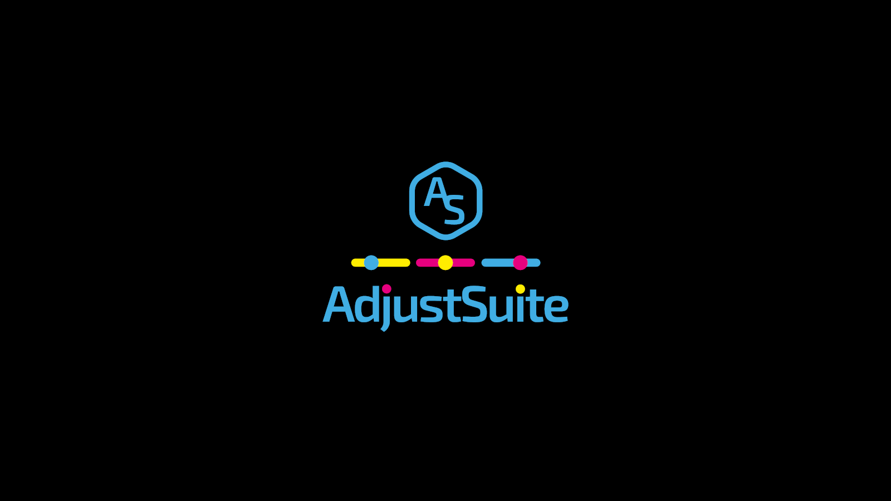

# 

  

  
[WEBSITE](https://blu3cow.com) | [DOWNLOAD](https://github.com/BLU3COW/FS25_AdjustSuite/releases) | [README](README.md) | [CONTRIBUTING](CONTRIBUTING.md) | [CHANGELOG](CHANGELOG.md) | [ISSUES](https://github.com/BLU3COW/FS25_AdjustSuite/issues) | [DISCUSSIONS](https://github.com/BLU3COW/FS25_AdjustSuite/discussions) | [PULLS](https://github.com/BLU3COW/FS25_AdjustSuite/pulls) | [WIKI](https://github.com/BLU3COW/FS25_AdjustSuite/wiki) 

 

Customize vehicles and attachments in “FS25” to suit your personal playstyle. Optimize performance, working width, capacity, weight, handling, and much more so that every machine is perfectly suited to your farm, your fields, and your workflows. Whether you want to play in Real, Unreal, or Extreme mode, you decide how your game behaves! Further improvements and new modules are in development. Want to help shape the project? Then feel free to get involved and share your requests, suggestions, or ideas for improvement.

  

 ➡️​ <strong>Deutsch</strong> ⬅️ ​

   

Passe Fahrzeuge und Anbaugeräte im „LS25“ ganz nach deinem persönlichen Spielstil an. Optimiere Leistung, Arbeitsbreite, Kapazitäten, Gewicht, Fahrverhalten und vieles mehr damit jede Maschine perfekt zu deinem Hof, deinen Feldern und deinen Arbeitsabläufen passt. Egal ob du Real, Unreal oder Extreme spielen möchtest, du entscheidest wie sich dein Spiel verhält! Weitere Verbesserungen und neue Module sind in der Entwicklung. Du möchtest das Projekt mitgestalten? Dann bring dich gerne ein und teile deine Wünsche, Vorschläge oder Ideen zur Verbesserung.

 

  

 

## 

| Range | - % | + % | Steps | Default |
| --- | --- | --- | --- | --- |
| BASE | -0 % | +0 % | --- | ON |
| REAL | -20 % | +20 % | 5 % | ON |
| UNREAL | -80 % | +200 % | 20 % | OFF |
| EXTREME | -80 % | +800 % | 100 % | OFF |

 

By default, only the REAL range is enabled. This keeps all adjustments within a balanced range and aligns them as closely as possible with realistic values. The BASE range serves as an unmodified baseline without any percentage adjustments. With REAL, you can make minor changes without significantly altering the gameplay experience. UNREAL offers significantly more leeway for freer adjustments, while EXTREME is intended for maximum customization if you deliberately want to go well beyond realistic limits. If you want more freedom with the settings, you can define wider adjustment ranges in the modSettings.xml file and tailor the mod even more precisely to your personal playstyle. However, always keep in mind the game’s logical and physical limits, as values that are too extreme can affect handling, the functionality of individual devices, or the game’s balance.​

 ➡️​ <strong>Deutsch</strong> ⬅️ ​

   

Standardmäßig ist nur der Bereich REAL aktiviert. Dadurch bleiben alle Anpassungen in einem ausgewogenen Rahmen und orientieren sich möglichst nah an realistischen Werten. Der Bereich BASE dient als unveränderte Grundlage ohne prozentuale Anpassung. Mit REAL kannst du kleinere Änderungen vornehmen, ohne das Spielgefühl stark zu verändern. UNREAL bietet deutlich mehr Spielraum für freiere Einstellungen, während EXTREME für maximale Anpassungen gedacht ist, wenn du bewusst deutlich über realistische Grenzen hinausgehen möchtest. Wenn du mehr Freiheit bei den Einstellungen wünschst, kannst du in der Datei modSettings.xml größere Anpassungsbereiche festlegen und den Mod noch genauer auf deinen persönlichen Spielstil abstimmen. Beachte dabei jedoch immer die logischen und physikalischen Grenzen des Spiels, da zu extreme Werte das Fahrverhalten, die Funktion einzelner Geräte oder die Spielbalance beeinflussen können.

 

## 

| Module | English | German | Default |
| --- | --- | --- | --- |
| AFV | Fill Volume | Füllvolumen | ON |
| AMP | Motor Power | Motorleistung | ON |
| AWS | Working Speed | Arbeitsgeschwindigkeit | ON |
| AWW | Working Width | Arbeitsbreite | ON |
| APW | Pickup Width | Pickupbreite | ON |
| ADS | Driving Speed | Fahrgeschwindigkeit | ON |
| ABP | Brake Power | Bremskraft | ON |
| ADR | Discharge Rate | Entladerate | ON |

 

By default, all modules are enabled. Each module controls a specific customization area and can be turned on or off individually as needed. This allows you to decide for yourself which characteristics of your vehicles and attachments should be modified and which areas should remain unchanged. With AFV, you can adjust the fill volume, for example, for trailers, tanks, seeders, spreaders, or other equipment with a capacity. AMP controls engine power and allows you to make vehicles more powerful, less powerful, or better suited to specific tasks. AWS lets you adjust the working speed of implements, such as when seeding, fertilizing, harvesting, or tilling. AWW changes the working width of implements so that fields can be worked more quickly, more comfortably, or more realistically. With APW, you can adjust the pickup width, for example, on load wagons, balers, or other implements with a pickup function. ADS controls the travel speed of vehicles, while ABP influences braking force, thereby ensuring more appropriate handling. ADR also allows you to adjust the unloading rate, that is, the speed at which trailers, tanks, or implements discharge their load.

 ➡️​ <strong>Deutsch</strong> ⬅️ ​

   

Standardmäßig sind alle Module aktiviert. Jedes Modul steuert einen bestimmten Anpassungsbereich und kann bei Bedarf einzeln ein- oder ausgeschaltet werden. So kannst du selbst entscheiden, welche Eigenschaften deiner Fahrzeuge und Anbaugeräte verändert werden sollen und welche Bereiche unverändert bleiben. Mit AFV passt du das Füllvolumen an, zum Beispiel bei Anhängern, Tanks, Sämaschinen, Streuern oder anderen Geräten mit Kapazität. AMP steuert die Motorleistung und ermöglicht es, Fahrzeuge stärker, schwächer oder besser auf bestimmte Aufgaben abzustimmen. Über AWS lässt sich die Arbeitsgeschwindigkeit von Geräten anpassen, etwa beim Säen, Düngen, Ernten oder bei der Bodenbearbeitung. AWW verändert die Arbeitsbreite von Geräten, damit Flächen schneller, komfortabler oder realistischer bearbeitet werden können. Mit APW passt du die Pickupbreite an, zum Beispiel bei Ladewagen, Ballenpressen oder anderen Geräten mit Aufnahmefunktion. ADS steuert die Fahrgeschwindigkeit von Fahrzeugen, während ABP die Bremskraft beeinflusst und so für ein passenderes Fahrverhalten sorgen kann. Über ADR lässt sich außerdem die Entladerate anpassen, also die Geschwindigkeit, mit der Anhänger, Tanks oder Geräte ihre Ladung abgeben.

 

## 

| Module | English | German | Default |
| --- | --- | --- | --- |
| **HELPMENU** | Show in Helpmenu | Anzeige im Hilfemenü | Activ |
| **PRICE** | Adjust Prices | Preise | 100 % |

 

By default, these options are enabled or set to their default values. They complement the actual customization modules and affect how the mod is displayed in the game and how changes impact the game’s economy. HELPMENU controls whether the mod’s functions and hints are displayed in the help menu. If this option is enabled, you’ll receive relevant in-game information directly through the help menu, making it easier to understand which features are available. Using PRICE, you can specify how much adjustments affect prices. The default value is 100%, which corresponds to the normal price calculation. Depending on your settings, vehicles and attachments can be made cheaper, more expensive, or better suited to your preferred playstyle.

 ➡️​ <strong>Deutsch</strong> ⬅️ ​

   

Standardmäßig sind diese Optionen aktiviert beziehungsweise auf ihren Grundwert eingestellt. Sie ergänzen die eigentlichen Anpassungsmodule und beeinflussen, wie der Mod im Spiel dargestellt wird und wie sich Änderungen auf die Wirtschaftlichkeit auswirken. Mit HELPMENU wird gesteuert, ob die Funktionen und Hinweise des Mods im Hilfemenü angezeigt werden. Ist diese Option aktiviert, erhältst du im Spiel passende Informationen direkt über das Hilfemenü und kannst leichter nachvollziehen, welche Funktionen verfügbar sind. Über PRICE kannst du festlegen, wie stark sich Anpassungen auf die Preise auswirken. Der Standardwert liegt bei 100 % und entspricht damit der normalen Preisberechnung. Je nach Einstellung können Fahrzeuge und Anbaugeräte günstiger, teurer oder besser an deinen gewünschten Spielstil angepasst werden.

 

 

  

<strong>‼️Click to View “modSettings.xml” | Hier Klicken um „modSettings.xml“ anzuzeigen‼️</strong>
 

   
#### C:\Users\YourPC\Documents\My Games\FarmingSimulator2025\modSettings\modSettings.xml
The “modSettings.xml” is created automatically when the mod is started for the first time.

You can Adjust:

- Adjustment Ranges
- Modules
- Helpmenu
- Prices

 
 

## 

## 

## 

If AdjustSuite helps you, you can support development through PayPal or Buy Me a Beer. | Wenn Ihnen AdjustSuite weiterhilft, können Sie die Entwicklung über PayPal oder „Buy Me a Beer“ unterstützen.

  

## 

